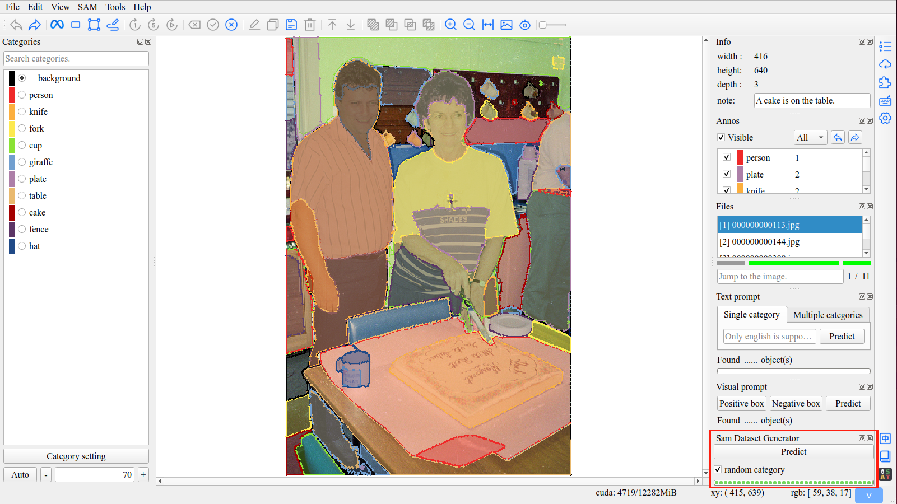

# ISAT插件 - sam数据集生成

通过SamAutomaticMaskGenerator类，生成大量mask，通过微调后，可用于sam训练。

仅使用207行代码，开发一个带界面的ISAT插件，使ISAT支持everything分割模式，生成大量无类别mask，用于sam训练。




## 安装与使用

### 安装
下载源码后，执行
```shell
python setup.py install
```

### 使用

- 运行isat
- 插件界面，激活SamDatasetGenerator即可
